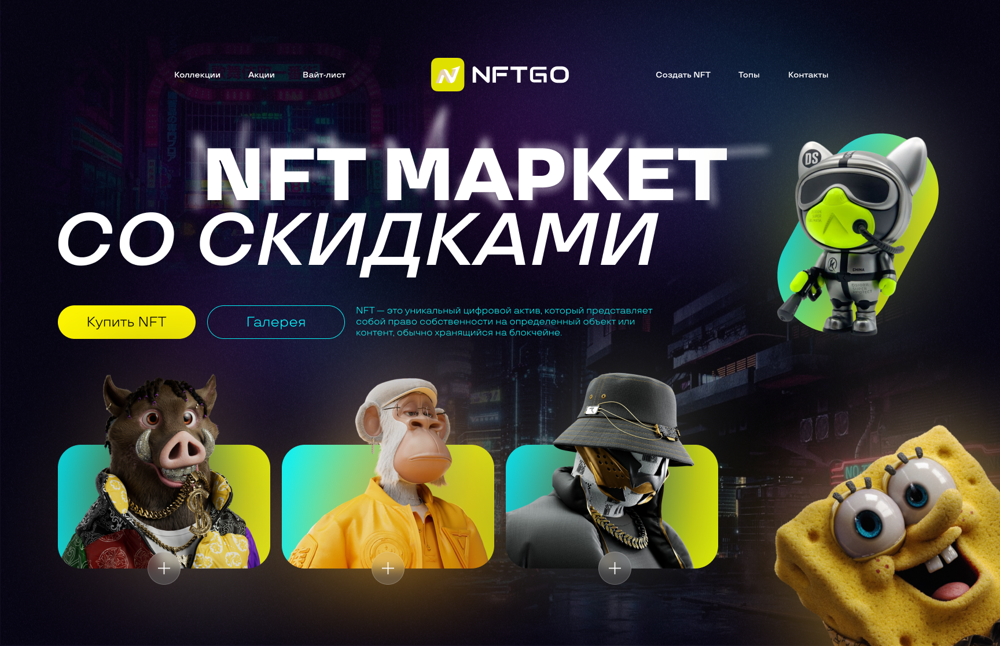
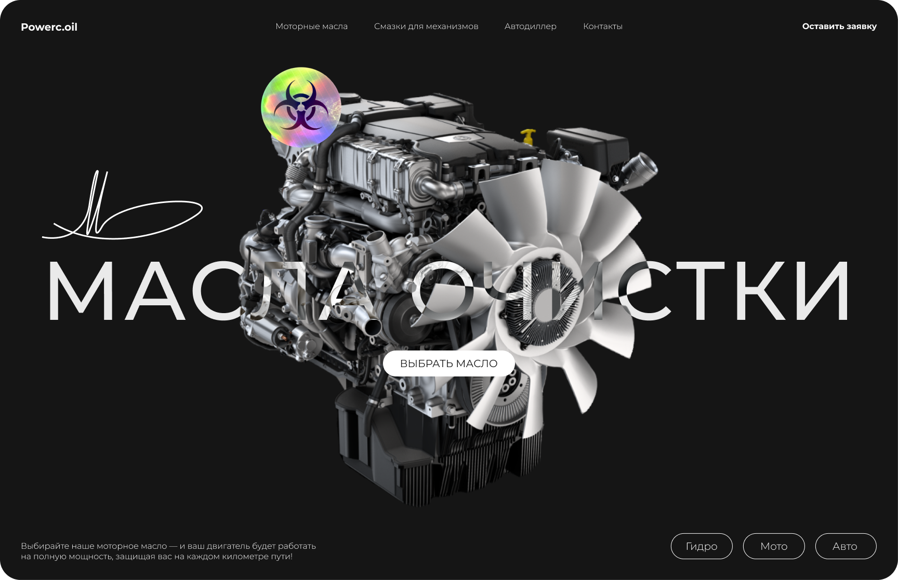
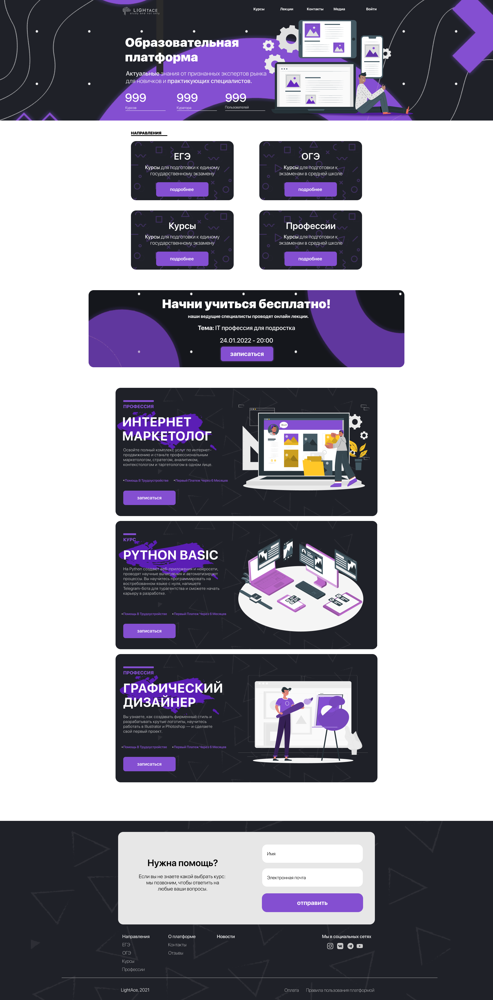

# Реклама и Менеджмент

Добро пожаловать в мой репозиторий, посвященный проектам в области рекламы и менеджмента. Здесь вы найдете мои работы, созданные в Figma, а также описание каждого проекта и его особенностей.

## Акции 
- [О себе](#о-себе)
- [О проекте](#о-проекте)
- [Проекты](#проекты)
  - [Проект 1](#проект-1)
  - [Проект 2](#проект-2)
  - [Проект 3](#проект-3)
  - [Проект 4](#проект-4)

## О себе

Я общительный и легко обучаемый человек, способный находить общий язык с разными людьми. Мои навыки в сфере продаж охватывают как B2B, так и B2C сегменты, что позволяет мне эффективно взаимодействовать с клиентами и удовлетворять их потребности. 

У меня есть опыт работы в различных отраслях, что помогает мне быстро адаптироваться к новым условиям и задачам. Я обладаю аналитическим мышлением, что позволяет мне выявлять потребности клиентов и предлагать им оптимальные решения. 

Я умею работать в команде и ценю сотрудничество, что способствует созданию положительной атмосферы на рабочем месте. Мои коммуникативные навыки помогают мне устанавливать доверительные отношения с клиентами и коллегами, что, в свою очередь, способствует достижению общих целей.

Кроме того, я активно интересуюсь новыми технологиями и тенденциями в области продаж и маркетинга. Это позволяет мне быть в курсе последних событий и применять новые стратегии для повышения эффективности работы.

Я также обладаю навыками ведения переговоров и разрешения конфликтов, что позволяет мне успешно справляться с различными ситуациями в процессе работы. Моя целеустремленность и настойчивость помогают мне достигать поставленных целей и преодолевать трудности.

Я готов к новым вызовам и стремлюсь к профессиональному росту, чтобы внести значимый вклад в развитие компании, в которой буду работать.

## О проекте

В этом reame файле представлены скриншоты различных проектов, которые я разработал в области рекламы и менеджмента. Каждый проект включает в себя уникальные решения и креативные идеи, направленные на достижение бизнес-целей. Все проекты размещены в фигме, ссылка ниже.

## Проекты

### Проект 1

**Название:** Название проекта 1  
**Описание:** Краткое описание проекта, его цели и задачи.  
**Ключевые особенности:**
- Особенность 1
- Особенность 2
- Особенность 3
**Ассеты работы**

### Проект 2

**Название:** Название проекта 2  
**Описание:** Краткое описание проекта, его цели и задачи.  
**Ключевые особенности:**
- Особенность 1
- Особенность 2
- Особенность 3
**Ассеты работы**

### Проект 3

**Название:** Название проекта 3  
**Описание:** Краткое описание проекта, его цели и задачи.  
**Ключевые особенности:**
- Особенность 1
- Особенность 2
- Особенность 3
**Ассеты работы**

### Проект 4

**Название:** Название проекта 3  
**Описание:** Краткое описание проекта, его цели и задачи.  
**Ключевые особенности:**
- Особенность 1
- Особенность 2
- Особенность 3
**Ассеты работы**

## Контакты

Если у вас есть вопросы или предложения, не стесняйтесь связаться со мной:

- **Email:** ale42423415@yandex.ru
- **telegram:** https://t.me/TryDBix
- **Figma** https://www.figma.com/design/qEaM2JaLDrCHgvwPbr7FC2/Untitled?node-id=0-1&t=4Go9XWM7azC6OGhU-1

Спасибо за внимание!
